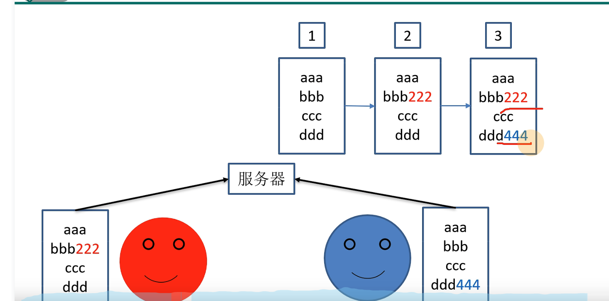
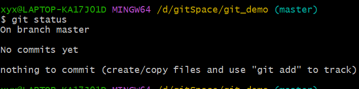

# Git
## git概述
* git是一个免费开源的**分布式版本控制系统**
> ### 版本控制?
> 1. 能够保存和切换文件的历史版本  
> 2. 防止后人修改覆盖前人修改,由版本控制系统实现不同版本文件的合并
>    
> 
> ### 分布式版本控制or集中式版本控制?
> 集中式版本控制:  
> 所有人从中央服务器上下载文件后,将不同版本的文件提交到中央服务器;  
>   
> 优点: 便于管理员分配权限  
> 缺点: 中心服务器的宕机导致项目无法更新  
>
> 分布式版本控制:  
>   
> 每个人的PC机就作为一个版本控制系统,
> **版本控制是在本地进行的,每个客户端保存的是完整的项目**
>   
>
> ### 工作机制
>     
> 工作区和缓存区的代码可以删除,但是**提交到本地库的历史版本无法删除**
>
> ### 代码托管中心
>   
>
## git常用命令
1. 用户签名：用于识别不同用户（**必须要设置，否则提交代码会报错**）
      
2. 本地库初始化：  
      
3. 查看本地库状态：   
      
    第一行表示所在分支；第二行表示当前库为空；第三行表示没有可追踪的文件  
      
    在当前demo创建文件
      
    显示可追踪文件hello.txt,此时暂存区还没有保存文件  
      
    调用"git add"命令，将工作区的文件保存到暂存区，此时暂存区显示创建了新文件
      
    调用"git rm --cached hello.txt"删除暂存区文件，工作区的文件不会被删除
4. 提交本地库： git commit -m "版本备注" [文件名]  
      
    显示没有待提交文件，同时工作区也被清空
5. 查看本地库历史版本状态： git reflog    
      
   当前指针指向第三个版本
6. 将指针指向不同的历史版本： git reset --hard [版本号]  
    
7. 分支的创建、切换、合并  

## gitHub 基本操作
1. 创建远程库别名：    
2. 推送本地库至远程库：  
3. 拉取远程库到本地库：  只需要将推送中的“push” 更改为“pull”  **拉取和推送都需要制定一个分支，拉取指定拉取远程库的哪个分支，推送指定推送本地库的哪个分支**  
4. 克隆fork远程库到本地库：  克隆是复制远程库的所有内容，所以无须指定分支。